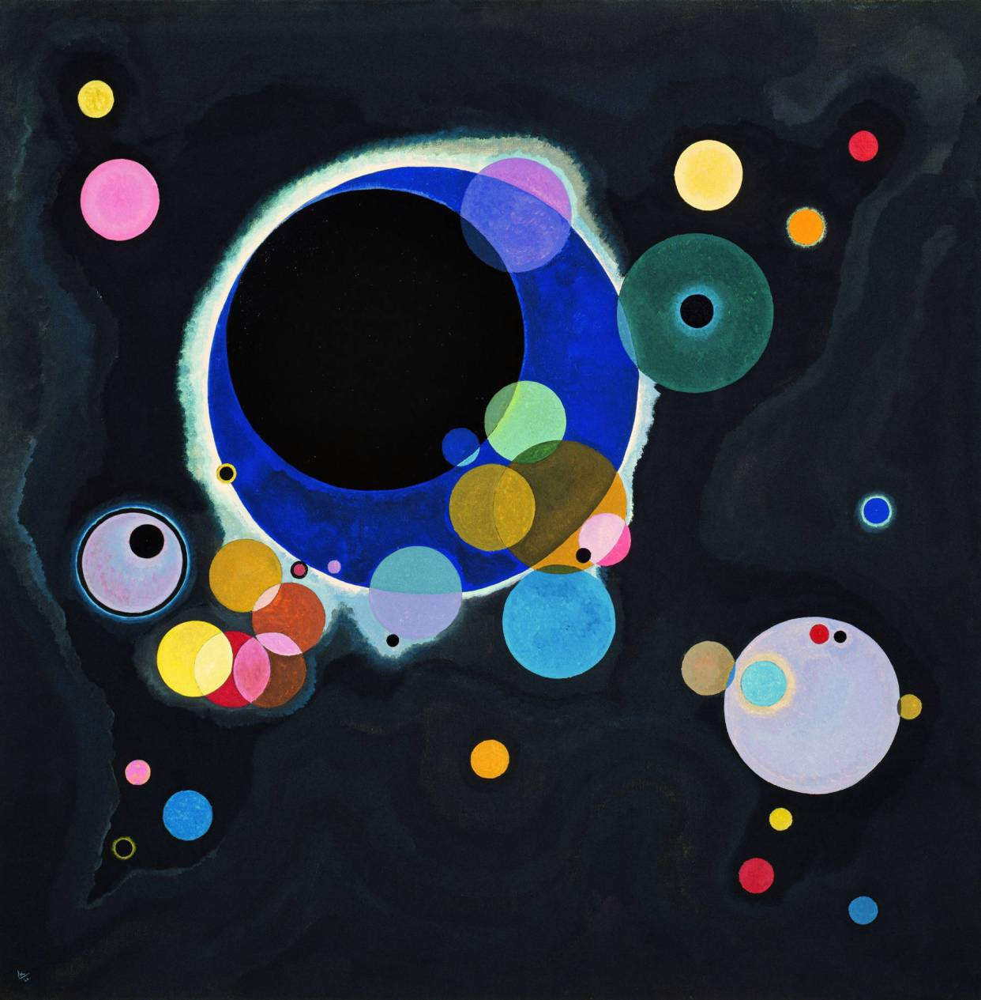

# Ledstrip Art project 
This project aims to make an LED art installation of the Vasily Kadinsky "einige kreise" picture - see pictures below. 
The installation will be driven by 2 Arduino Mega 2560's ( one for the LEDs, one for a remote control ); each colored 
circle can change color independently.  

Here's the final installation - you fine some pictures if you scroll down, or look [here](./pics/)

 

## What i could have done better
- every plywood sheet should have had a SINGLE connector to connect to the MAIN sheet with 
  the microcontrollers. Currently I have one centralized place where all connects - so taking the 
  whole piece apart is a big mess as i have to disconnect 36 connectors and loose all the pin-layout. 
  Not good. Next time, one central connector per Plywood sheet, with a single cable running to 
  the microcontroller. Not 1000's of cables. it's also easer to build as you can measure the
  length of the cables better. 
- do the edges in an angled fashion so it looks more like "floating" / cut the sides in angles
  where the top plywood is smaller than the one below, than the one below, than the one below...

## Notes 
Here are some good reads on colors and color theory: 

[The color wheel](https://blog.asmartbear.com/color-wheels.html) 
[Hue angle transitions](http://rileyjshaw.com/blog/hue-angle-transitions/)

I created a nice color transition in [JSfiddle](https://jsfiddle.net/user/vogelj/).

## Stuff needed 
- thin pywood sheets ( 5mm think so it's not too heavy 
  ( home depot, cut the 8x4 sheets into 4 x 4 squares ) 
- 2 x Arduino Mega 2560 
- LED strips WS2812B 5V
- Power supply : I ordered a fan-less Mean Well HSN 300 watts 5V supply. 
  (That's 60 Amps - I went a little over the top as i did not now at the start 
   how many LEDs I have to power. I used 700 LEDS which need  42 Amps max. 
  [Power supply](http://www.trcelectronics.com/View/Mean-Well/HSN-300-5A.shtml)
- JST connectors and 3-cables from Amazon
- Soldering iron 
- Solder - Mandala Crafts 60 40 0.6mm 0.8mm 1mm 1.5mm 2% Flux Rosin Core Solder Wire (50g, 60 40, 0.8mm)
  https://www.amazon.com/dp/B06XX27KZ1/

## Libraries /  Software / Dependencies
I'm using the FastLED library to drive my WS2812B 5V LED strips which have individually addressable LEDs. I bought them online. 
 
- [Arduino FastLED library](https://github.com/FastLED/FastLED)
- Infrared library ( currently used: : IRemote. I like to switch to the IRlib2 later. It has conflicts with the interrupts used by FastLED, 
  so I decided to use 2 Arduinos: one to deal with the remote and the LCD display, and one which drives the LEDs.
- [Easytransfer_I2C](has://github.com/madsci1016/Arduino-EasyTransfer) - to communicate between 2 Arduinos via Serial interface 

## Project status and files 
After realizing that there are some timing problems when using the FastLed library together with an IR-remote (the FastLed library turns all interrrupts off), I decided to use 2 Arduino boards for the project: 

 1.  1 x Arduino MEGA to drive the User interface ( the MASTER) 
 * LCD display with keypad 
 * Menu structure on LCD 
 * IR receiver to remote control the same menu with an IR remote 
 * uses EasyTransfer library to send data via I2C to the Arduino Mega  

 2.  1 x Arduino MEGA which controls the FastLED patterns and strands (the SLAVE)
 * uses FastLED library to drive the strands 
 * EasyTransfer library to receive data via I2C from the Arduino Uno menu / UI and translate them into 
   visible patterns
 * code for patterns, transitions, and FastLED configuration 
 * I'm driving 700 LEDS distributed over 36 strands. Each strand has a differnt number of LEDs; 
   this was a bit of a challenge as the 'usual' way of using a two-dimensional array for all LEDS 
   eats up too much memory. 
   I had to modfify the FastLED library to add some methods which allow me to work with a different 
   data structure.

## Todo 
- switch to differnt IR library ( see [example](./EXAMPLE_irlib2_remote_fastled)
- 
## Code  

## Code Stages 

### UNO_LCD_I2C_TX_example 
File UNO_LCD_I2C_TX_example.ino contains a fully working example for the Arduino Uno which 
  - shows a menu for 2 LED strands + some global configuration 
  - interfaces with an IR remote to use the menu   
  - interfaces with a keypad on the menu to choose functions 
  - sends the data to the Arduno Mega via I2C communication 

This example uses the following libraries: 
 - Wire.h
 - EasyTransferI2C.h
 - LiquidCrystal.h
 - MenuEntry.h"
 - MenuLCD.h"
 - MenuManager.h"
 - IRremote.h
 - IRremoteInt.h

## Todo: 

- allow to control brightness of strands individuall ( could be combined with the on/off possibility )    
- allow to switch individual strands on/off 

- Create solid patterns: red, green, blue
  Create solid transitions of full strand : red -> green -> blue -> ...
- add new transitons ( turning / rgb color circles ) 
- add beserker mode ( blinking in high frequency with different colors ) 

- store favorite configs and add possibility to cycle trough them. [ 0, 2, 1, 0 ] ... strips don't need to be all the same theme

- adjust speed of some patterns ? 

## Done : 
- reset function [ go back to start config ] 
- add possibility to cycle all strands trough all patterns together 
- switch all strands on / off 
- control brightness of all strands with single button  
- change the strand themes individually per strand 

 

 

 

More pictures can be found [here](./pics/.jpg) 

